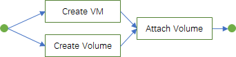

# vastflow

A lightweight, high-performance, scalable, and easy-to-use task orchestration framework. 
The program model used to implement the framework is derived from the relevant concepts of the Amazon basin, 
which makes the programmer feel like drawing a wonderful picture during the task orchestration.

## basic concept

The Amazon River Basin is composed of many large and small rivers. 
It is the world's largest river with the largest average flow, the widest basin area, and the most tributaries. 
The model construction of the framework is abstracted using the concept of related objects of the Amazon River.

* andes

The birthplace of the Amazon, used to express the starting object of the task

* headerwaters

The source of water flowing into the starting point of the river, used to express the context of the task

* river

River, the basic operation unit of the task, based on this model, a variety of task units can be constructed

* parallel river

Parallel River, used for tasks that do not depend on each other to run simultaneously

* basin

used to express the operation of two or more completely independent tasks, 
the context is completely isolated and does not interfere with each other

* atlantic

Atlantic, the final destination of each river, used to express the processing logic at the end of the task

---

## how to use

### For example, arrange a task as shown below



The figure describes a simple task, create a new virtual machine, and then mount the data volume to the new virtual machine

### Code implement

First encapsulate the atomic capabilities of each task, such as creating virtual machines, creating volumes, and mounting volumes. 
The atomic capabilities can also be assembled and reused in other businesses in the future;
Then consider the processing at the end of the task, such as updating the task or resource status, and sending an alarm if it fails;

After the atomic capability is ready, the final step is the orchestration work. The code will be very concise, like below.
```go
	hw := vastflow.NewHeadwaters(uuid.NewV4().String())
	hw.Put("vmName", "my-vm")
	hw.Put("volName", "my-vol")

	// parallel river draw
	pr := &vastflow.ParallelRiver{}
	pr.Append(new(CreateVmRiver))
	pr.Append(new(CreateVolumeRiver))

	// andes draw
	an := vastflow.Andes{}
	an.DrawHeadWaters(hw)
	an.DrawStream(pr)
	an.DrawStream(new(AttachVolumeRiver))
	// atlantic draw
	an.DrawAtlantic(new(AttachVolAtlantic))

	an.Start()
```

Implement `CreateVmRiver, CreateVolumeRiver, AttachVolumeRiver`，detail to see the example.go

* Implement 3 atomic rivers

```go
type CreateVmRiver struct {
	vastflow.River
}

func init() {
	vastflow.RegisterStream(new(CreateVmRiver))
}

func (r *CreateVmRiver) Update(attr *vastflow.RiverAttr) {
	attr.CycleInterval = 1
	attr.CycleTimes = 10
	attr.Durable = true
}

func (r *CreateVmRiver) Flow(headwaters *vastflow.Headwaters) (errCause string, err error) {
	fmt.Println("CreateVmRiver flow, name:", headwaters.Get("vmName"))
	time.Sleep(time.Second)
	vmId := "vmId1"
	headwaters.Put("vmId", vmId)
	fmt.Println("create vm req over")
	return "", nil
}

func (r *CreateVmRiver) Cycle(headwaters *vastflow.Headwaters) (errCause string, err error) {
	fmt.Println("CreateVmRiver cycle, vmId:", headwaters.Get("vmId"))
	fmt.Println("create vm success")
	return "", nil
}
```

* Implement 1 atlantic

```go
type AttachVolAtlantic struct {
	vastflow.Atlantic
}

func init() {
	vastflow.RegisterAtlantic(new(AttachVolAtlantic))
}

func (r *AttachVolAtlantic) Success(headwaters *vastflow.Headwaters) error {
	fmt.Println("attach success, we should update status")
	return nil
}

func (r *AttachVolAtlantic) Fail(headwaters *vastflow.Headwaters) error {
	fmt.Println("attach fail, we should send alarm")
	return nil
}
```


## Support

If you have any suggestions or need support, you can describe the problem and background by submitting an issue, 
we will reply as soon as possible
